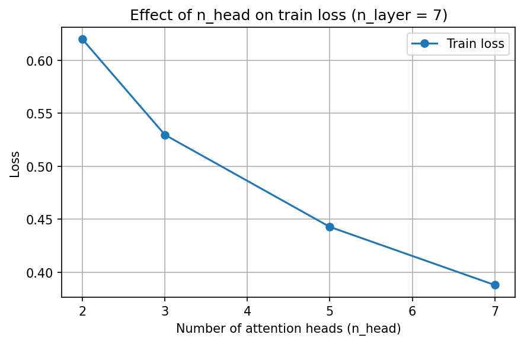

# SEEM3650Practical-Exam2-1155214438-
## Generated shakespeare char samples

Clown:
So it is a purpose but
back.

AUFIDIUS:
Sirrah, you have
heard him foul and tell him him at, and him he
has a rizerous
and spring it. But if you will, even we send, will it
there between you there in your pelicious part
than you have stand as speak you: sir, I will attend your
tribunes of all one wound that it seems it, so far
you deny to our weak. Here cannot ruin for the great lament
purse of the fiery death? here's such a bed inchards.

POLIXENES:
How now! as it not remember
To five y

## Plots saved in figures/ and report validation loss
n_layer = 7
n_head = 2
step 5000: train loss 0.6197, val loss 1.7125

n_layer = 7
n_head = 3
step 5000: train loss 0.5296, val loss 1.7925

n_layer = 7
n_head = 5
step 5000: train loss 0.4428, val loss 1.8812

n_layer = 7
n_head = 7
step 5000: train loss 0.3880, val loss 1.9469

## best settings
n_layer = 7
n_head = 2
train loss 0.6197, val loss 1.7125

## data inside data/code generation/input.txt

## generated code samples
---------------
assert(kind == PyUnicode_1BYTE_KIND);
                                    PyUnicode_GET_LENGTH(start, left);
                                                \
                            else if (PyUnicode_2BYTE_DATA(start, len) == -1) {
                                                                         \
                                                                                                                                                       \
               
---------------

                                                                                                                                                                                                         \
          (__m128i *)) __m128i srrunstbi__err("bad self", "bad in_16 in__8CAN_); \

             __m128i diff_m_set1_epi32((__m128i *), x, y); \
                diffed(__m128i *) dif0e0 * x0 = dif1; \
                                                                                   ) \
         
---------------

                                                                                          else                                                                     3,  };
           }
       else {
            Py_UCS4 ch = PyUnicode_READ(kind, data, i);
             if (ch == 0x80000) {
               ch = PyUnicode_READ(kind, data, i);
                f+;
           }
          else {
                   ch = (char) ch;
                   if (ch < 110000)
                     break;
             
---------------

                                          encode,                                                                                                                                                                                                                                                                                                 Py_ssize_t width, Py_ssize_t size, (Py_UCS4 *)writer.kind,
                                continue;
                       memcpy( writer, new_args, user, finals
---------------

           Py_ssize_t len;
           Py_ssize_t len;
        Py_ssize_t len;

           if (linel) {
                 PyBytesDict *length;
              Py_ssize_t length;
            int len1, len2;
               len2;
               int kind2;
                  int p_len2;
                 /* len2 input is line */
             Py_DECREF(Py_INTERNED(i));
               return NULL;
           }
      }

        bool case Py_DECREF(input_length);
      case PyUnicode_2BYTE_KIND:
         if (
---------------

  

